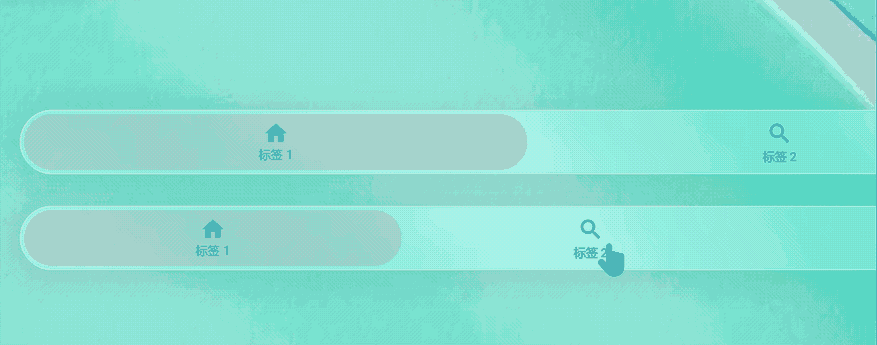
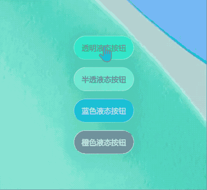
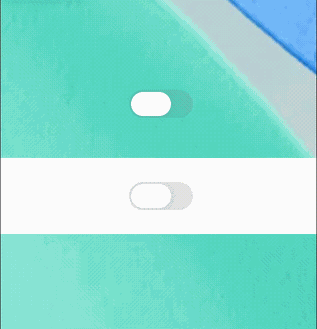
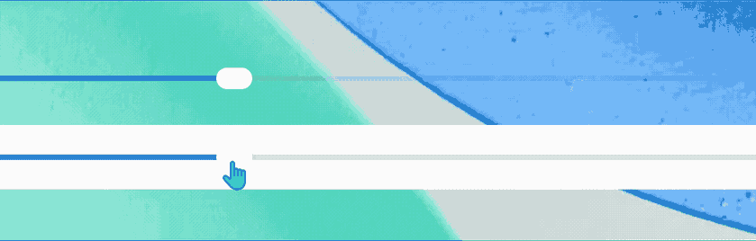
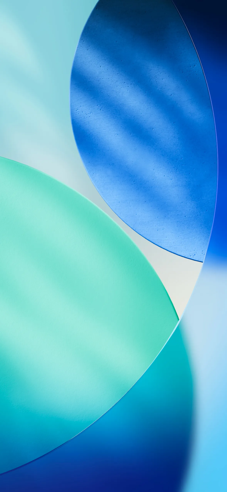

# Liquid Glass WebGL



**WebGL liquid glass effects for the browser.** This project ports the visual ideas and shader pipeline of the original Android/Compose Multiplatform liquid glass project [`Kyant0/AndroidLiquidGlass`](https://github.com/Kyant0/AndroidLiquidGlass) to the frontend. It is an independent web implementation, not an official web package from the original author.

**面向浏览器的 WebGL 液态玻璃效果库。** 本项目将原始 Android/Compose Multiplatform 液态玻璃项目 [`Kyant0/AndroidLiquidGlass`](https://github.com/Kyant0/AndroidLiquidGlass) 的视觉效果和着色器管线移植到前端。它是独立的 Web 实现，不是原作者发布的官方 Web 包。

## Highlights | 特性

- Real-time WebGL refraction, chromatic aberration, blur, vibrancy, highlights, shadows and inner shadows.
- 基于 WebGL 的实时折射、色散、高斯模糊、饱和度增强、高光、阴影和内阴影。
- Ready-to-use liquid button, toggle, slider and bottom tab components.
- 提供可直接使用的液态按钮、开关、滑块和底部标签栏组件。
- A shared `BackdropSource` lets multiple glass elements sample the same wallpaper.
- 多个玻璃元素可以共享同一个 `BackdropSource`，采样同一张壁纸。
- CSS `backdrop-filter` fallback when WebGL is unavailable.
- WebGL 不可用时自动降级到 CSS `backdrop-filter` 毛玻璃效果。
- Device-pixel-ratio scaling, texture-size protection and explicit WebGL cleanup.
- 支持 DPR 自适应、纹理尺寸保护和 WebGL 资源释放。
- No framework required. Use it with vanilla JavaScript, or mount the returned DOM nodes in React/Vue.
- 不依赖前端框架，原生 JavaScript、React、Vue 均可使用。

## Demo | 效果演示

### Liquid buttons | 液态按钮



### Liquid toggle | 液态开关



### Liquid slider | 液态滑块



### Liquid bottom tabs | 液态底部标签栏


## Quick Start | 快速开始

### 1. Include the library | 引入库

```html
<link rel="stylesheet" href="lib/liquid-glass.css">
<script src="lib/liquid-glass.js"></script>
```

The current distribution is a browser script bundle. It exposes `window.LiquidGlass` and does not require a build tool.

当前版本是浏览器脚本封装，通过 `window.LiquidGlass` 使用，不需要构建工具。

### 2. Create a shared backdrop | 创建共享背景源

```html


<script>
  const { BackdropSource, Components } = LiquidGlass;
  const backdrop = new BackdropSource();
  const wallpaper = document.querySelector('#wallpaper');

  function start() {
    backdrop.setImage(wallpaper);

    const button = Components.createLiquidButton({
      backdrop,
      content: 'Liquid Button',
      tint: [0.05, 0.45, 1, 0.8],
      onClick: () => console.log('clicked')
    });

    document.body.appendChild(button);
  }

  if (wallpaper.complete && wallpaper.naturalWidth > 0) {
    start();
  } else {
    wallpaper.addEventListener('load', start, { once: true });
  }
</script>
```

All glass elements on the same page should normally share one `BackdropSource`.

同一页面中的玻璃元素通常应共享一个 `BackdropSource` 实例。

### 3. Run through HTTP | 通过 HTTP 运行

Do not open the demo directly with `file://`. WebGL image textures can be blocked or become tainted under the file protocol.

不要直接使用 `file://` 打开示例。文件协议可能导致 WebGL 图片纹理被污染或无法采样。

```bash
python server.py
```

Then open <http://localhost:8080>.

Windows users can also double-click `启动服务.bat`.

Windows 用户也可以双击 `启动服务.bat` 启动本地服务。

## Components | 组件

All component factories return a DOM element. Append it to your layout and call `.dispose()` when it is removed.

所有组件工厂都会返回一个 DOM 元素。将它添加到页面中，移除时调用 `.dispose()`。

### Button | 按钮

```js
const button = LiquidGlass.Components.createLiquidButton({
  backdrop,
  content: '确定',
  tint: [0, 0.53, 1, 0.8],
  surfaceColor: [1, 1, 1, 0.1],
  className: 'my-button',
  onClick: () => alert('确定')
});

container.appendChild(button);
```

Supported options | 支持的参数：

| Option | Type | Description | 说明 |
| --- | --- | --- | --- |
| `backdrop` | `BackdropSource` | Shared background source | 共享背景源 |
| `content` | `string \| Node` | Text or a DOM node | 文字或 DOM 节点 |
| `tint` | `[r,g,b,a]` | Hue tint, values from 0 to 1 | 色调，取值 0 到 1 |
| `surfaceColor` | `[r,g,b,a]` | Surface overlay color | 表面叠加色 |
| `layers` | `array` | Extra backdrop layers | 额外背景层 |
| `onClick` | `function` | Click callback | 点击回调 |

### Toggle | 开关

```js
let enabled = false;

const toggle = LiquidGlass.Components.createLiquidToggle({
  backdrop,
  selected: () => enabled,
  onSelect: value => {
    enabled = value;
  }
});

container.appendChild(toggle);
```

The getter callbacks are polled by the component update loop, so external state changes are reflected automatically.

组件会读取 getter 回调，因此外部状态变化可以自动同步到控件。

### Slider | 滑块

```js
let volume = 50;

const slider = LiquidGlass.Components.createLiquidSlider({
  backdrop,
  value: () => volume,
  onValueChange: value => {
    volume = value;
  },
  valueRange: [0, 100]
});

container.appendChild(slider);
```

### Bottom tabs | 底部标签栏

```js
let activeTab = 0;

const tabs = LiquidGlass.Components.createLiquidBottomTabs({
  backdrop,
  tabsCount: 4,
  labels: ['Home', 'Search', 'Saved', 'Profile'],
  selectedTabIndex: () => activeTab,
  onTabSelected: index => {
    activeTab = index;
  }
});

container.appendChild(tabs);
```

## Custom GlassElement | 自定义玻璃元素

For cards, panels and custom shapes, use `GlassElement` directly.

卡片、面板和自定义形状可以直接使用 `GlassElement`。

```js
const host = document.createElement('div');
host.style.cssText = [
  'position: relative',
  'width: 280px',
  'height: 120px',
  'border-radius: 28px'
].join(';');

const glass = new LiquidGlass.GlassElement(backdrop, {
  radii: [28, 28, 28, 28],
  shadowPad: 20,
  regionPad: 32
});

host.appendChild(glass.canvas);
host.insertAdjacentHTML('beforeend',
  '<div style="position:relative;z-index:2;padding:24px">Glass panel</div>'
);
container.appendChild(host);

function resize() {
  glass.setSize(host.clientWidth, host.clientHeight);
  glass.render({
    vibrancy: true,
    blurRadius: 7,
    refractionHeight: 16,
    refractionAmount: 28,
    surfaceColor: [1, 1, 1, 0.1],
    highlight: {
      style: 'default',
      width: 0.5,
      blurRadius: 0.25,
      alpha: 1,
      angle: 45,
      falloff: 1
    },
    shadow: {
      radius: 14,
      offsetX: 0,
      offsetY: 6,
      color: [0, 0, 0, 0.14],
      alpha: 1
    }
  });
}

resize();
window.addEventListener('resize', resize);

function cleanup() {
  window.removeEventListener('resize', resize);
  glass.dispose();
  host.remove();
}
```

The canvas is absolutely positioned with `pointer-events: none`; place content above it with `position: relative` and a higher `z-index`.

画布是绝对定位且 `pointer-events: none`，内容层应使用 `position: relative` 和更高的 `z-index` 放在其上方。

## BackdropSource | 背景源

```js
const backdrop = new LiquidGlass.BackdropSource();

// Image background | 图片背景
backdrop.setImage(imageElement);

// Solid-color fallback | 纯色降级背景，颜色范围为 0 到 1
backdrop.setSolid(0.85, 0.9, 0.92, 1);

// Return to the image | 恢复使用图片
backdrop.clearSolid();
```

For cross-origin images, set `image.crossOrigin = 'anonymous'` before assigning `src`, and make sure the server sends a compatible CORS header.

如果图片来自跨域 CDN，需要在设置 `src` 之前配置 `image.crossOrigin = 'anonymous'`，并确保服务器返回正确的 CORS 响应头。

## Render effects | 渲染参数

The following options are available on `GlassElement.render()`:

`GlassElement.render()` 支持以下参数：

| Option | Description | 说明 |
| --- | --- | --- |
| `vibrancy` | Increase backdrop saturation | 增强背景饱和度 |
| `blurRadius` | Gaussian blur radius in CSS pixels | CSS 像素单位的高斯模糊半径 |
| `refractionHeight` | Refraction depth | 折射深度 |
| `refractionAmount` | Refraction displacement | 折射位移量 |
| `depthEffect` | Make refraction follow depth | 让折射方向跟随深度 |
| `chromaticAberration` | RGB channel dispersion | RGB 通道色散 |
| `tint` | Hue tint `[r,g,b,a]` | 色调混合 |
| `surfaceColor` | Surface overlay `[r,g,b,a]` | 表面颜色叠加 |
| `highlight` | Edge highlight configuration | 边缘高光配置 |
| `shadow` | Drop shadow configuration | 外阴影配置 |
| `innerShadow` | Inner shadow configuration | 内阴影配置 |
| `colorControls` | Saturation, contrast and brightness | 饱和度、对比度和亮度调整 |
| `contentZoom` | Zoom sampled backdrop content | 放大采样到的背景内容 |
| `contentShift` | Shift sampled backdrop content | 位移采样到的背景内容 |
| `alphaMask` | Progressive top-to-bottom fade | 从上到下的渐进式透明遮罩 |
| `sdf` | Use an SDF image for a custom shape | 使用 SDF 图片定义自定义形状 |

For the complete parameter reference, inspect the comments in `lib/liquid-glass.js` and the original examples in this repository.

完整参数说明可参考 `lib/liquid-glass.js` 中的注释，以及本仓库中的示例文件。

## Project layout | 项目结构

```text
.
├── lib/
│   ├── liquid-glass.js       # Browser bundle | 浏览器单文件库
│   ├── liquid-glass.css      # Component styles | 组件样式
│   └── package.json          # Package metadata | 包元数据
├── examples/
│   └── quick-start.html      # Minimal usage example | 最小示例
├── js/                       # Original split source | 原始分模块源码
├── css/style.css             # Demo styles | 完整演示样式
├── assets/                   # Wallpaper and SDF assets | 壁纸与 SDF 资源
├── 演示/                      # Demo GIFs | 演示 GIF
├── index.html                # Full demo | 完整演示
├── diagnostic.html           # Diagnostic page | 诊断页面
├── server.py                 # Local HTTP server | 本地 HTTP 服务
└── 启动服务.bat              # Windows launcher | Windows 启动脚本
```

## Browser and performance notes | 浏览器与性能说明

- The effects require WebGL for the full visual result.
- 完整视觉效果需要浏览器支持 WebGL。
- The library caps device pixel ratio at 2 and protects against oversized textures.
- 库会将 DPR 限制为 2，并避免创建超过显卡限制的纹理。
- Keep the number of active glass elements reasonable, especially on mobile devices.
- 活跃玻璃元素不宜过多，移动设备上尤其需要注意性能。
- Always call `.dispose()` when a component or glass element is removed.
- 组件或玻璃元素移除时务必调用 `.dispose()`。
- The current package is distributed as a browser global. An npm/ESM build is not included yet.
- 当前版本以浏览器全局脚本形式发布，暂未提供 npm/ESM 构建。

## Credits and origin | 来源与致谢

This frontend implementation is inspired by and ported from the shader/effect concepts in:

本前端实现参考并移植了以下项目中的着色器和效果思路：

- **Original project | 原始项目:** [Kyant0/AndroidLiquidGlass](https://github.com/Kyant0/AndroidLiquidGlass)
- **Original library documentation | 原始库文档:** [Backdrop Documentation](https://kyant.gitbook.io/backdrop)
- **Original package | 原始依赖:** `io.github.kyant0:backdrop`

The original project is a Compose Multiplatform implementation. This repository adapts the effect pipeline to browser WebGL and adds browser-oriented DOM components and examples.

原始项目是 Compose Multiplatform 实现。本仓库将其效果管线适配到浏览器 WebGL，并增加了面向 DOM 的前端组件和示例。

## License | 许可证

This repository contains a web adaptation of code and shader concepts originating from the Apache-2.0-licensed project above. See [`LICENSE`](LICENSE) for the license text and attribution requirements.

本仓库包含源自上述 Apache-2.0 项目的 Web 适配代码和着色器思路。许可证全文及署名要求请参阅 [`LICENSE`](LICENSE)。
